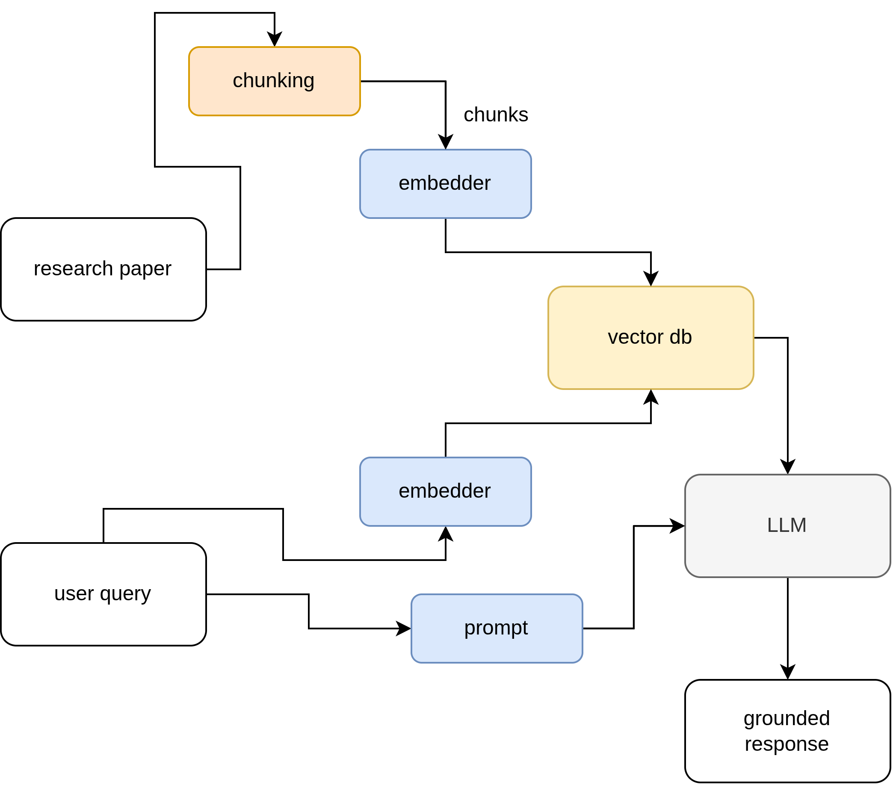

# paper-QA

A RAG (Retrieval-Augmented Generation) system for asking questions about a research paper and getting grounded, citation-backed answers instead of hallucinated ones.

## What it does

Point it at a PDF, and it builds a searchable knowledge base out of the paper's text. When you ask a question, it retrieves the most relevant chunks of the paper and hands them to an LLM as context, so the answer is grounded in what the paper actually says — if the answer isn't in the paper, the model is instructed to say so rather than make something up.

## Architecture



The pipeline has two stages:

1. **Ingestion** (`ingest.py`) — extract text from the PDF, split it into overlapping chunks, embed each chunk, and store the embeddings in a persistent vector database.
2. **Query** (`query.py`) — embed the user's question with the same model, retrieve the top-k most similar chunks from the vector DB, build a prompt with that context, and send it to an LLM to generate the final answer.

## Tools used and why

| Tool | Role | Why |
|---|---|---|
| [PyMuPDF](https://pymupdf.readthedocs.io/) | PDF text extraction | Fast, reliable text extraction with minimal dependencies. |
| [sentence-transformers](https://www.sbert.net/) (`all-MiniLM-L6-v2`) | Embeddings | Runs locally and free, no API calls or per-token cost for embedding — good enough quality for a single-paper retrieval task, and fast on CPU. |
| [ChromaDB](https://www.trychroma.com/) | Vector store | Runs embedded/local with zero infra to stand up, unlike Pinecone which needs a hosted account and network round-trips. Good fit for a single-paper, single-machine project. |
| [Groq](https://groq.com/) (`llama-3.3-70b-versatile`) | LLM inference | Groq's inference is extremely fast and has a generous free tier, making iteration quick. Llama 3.3 70B is capable enough for grounded Q&A at that speed/cost point. |

## How to run

### 1. Set up the environment

```bash
conda create -n paper_qa python=3.11
conda activate paper_qa
pip install -r requirements.txt
```

### 2. Add your API key

Create a `.env` file in the project root:

```
GROQ_API_KEY=your_groq_api_key_here
```

### 3. Add a paper

Drop a PDF into `papers/` (e.g. `papers/perpetual_wonder.pdf`).

### 4. Ingest the paper

```bash
cd scripts
python ingest.py
```

This extracts, chunks, embeds, and stores the paper in `data/chroma_db/`.

### 5. Ask a question

```bash
python query.py
```

Currently the question is hardcoded at the top of `query.py` — edit it there to ask something else.

## Current limitations / roadmap

- **Single paper at a time** — the pipeline is wired to one hardcoded PDF path. Next: support ingesting and querying across multiple papers.
- **Fixed-size chunking** — chunks are split by raw character count (1000 chars, 150 overlap), which can cut across sentences or sections. Next: try semantic/structure-aware chunking.
- **No UI** — everything runs via script with a hardcoded query. Next: a simple CLI or web interface for interactive Q&A.
- **No citation/source tracking in the answer** — retrieved chunks aren't surfaced back to the user alongside the answer. Next: return chunk provenance (e.g. page numbers) with each response.
